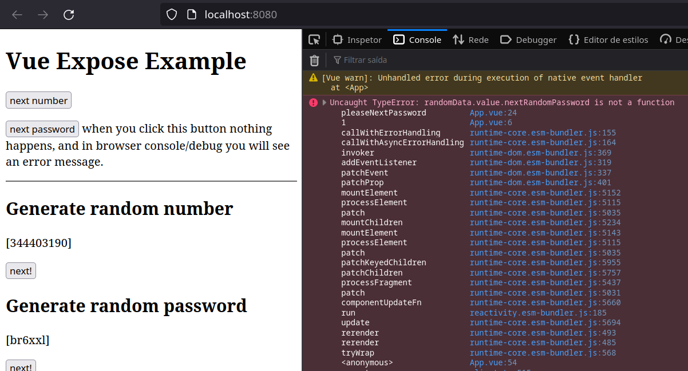

# vue-expose-example

This project show an example of the vue expose context feature.

The **expose** allows you to define which method will be visible to the parent component.

In a SomeComponent:

```javascript
export default defineComponent({
  setup(_, { expose }) {
    function someMethod() {
      //
    }

    function anotherMethod() {
      //
    }

    expose({
      someMethod,
    });
...
```

Now, in the parent component...

```javascript
<script>
import { defineComponent, ref } from "vue";
import SomeComponent from "./SomeComponent.vue";

export default defineComponent({
  components: { SomeComponent },
  setup() {
    const someComponent = ref();

    function doSomeAction() {
      someComponent.value.someMethod();
...
```



More details in [Vue.js API Reference](https://vuejs.org/api/composition-api-setup.html#setup-context).

Source: [Vue Mastery Blog](https://www.vuemastery.com/blog/understanding-vue-3-expose/).

## Project Setup

```sh
npm install
```

Or if you have in a linux environment with docker:

```sh
make run
```

### Compile and Hot-Reload for Development

```sh
npm run dev
```
